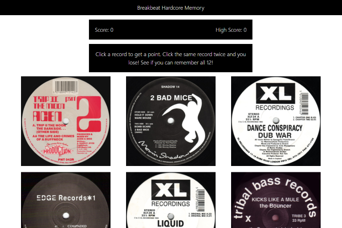

# Breakbeat Hardcore Memory Game
<https://jarrettd5309.github.io/clicky-game/> \
Version 1.0 \
Original Deployment Date - Aug 21, 2020\
By Jarrett Dougherty

<kbd></kbd>

## Description
Breakbeat Hardcore Memory is a game created with React.js. The theme of the game is early 1990s Breakbeat Hardcore UK Rave music, utilizing classic 12" record labels.

## Technologies Used
* React.js
* JavaScript
* HTML
* CSS
* Bootstrap

## Game Play
Click a record label to gain a point. After each click the record labels will randomly reorganize in the display. If the same label is clicked twice, you lose the game.

## Goal
Try to remember which labels you have already clicked. Click all 12 labels, without clicking any twice, to win the game!

## Instructions for GitHub Code
1. Once you have downloaded the program you will need to run the following command to install the required node packages.

```console
$ npm install
```

2. Run the following code to start the app in your local environment.

```console
$ npm start
```

3. Open `http://localhost:3000` in your browser to view the app.


### Note
This project was bootstrapped with [Create React App](https://github.com/facebook/create-react-app).

